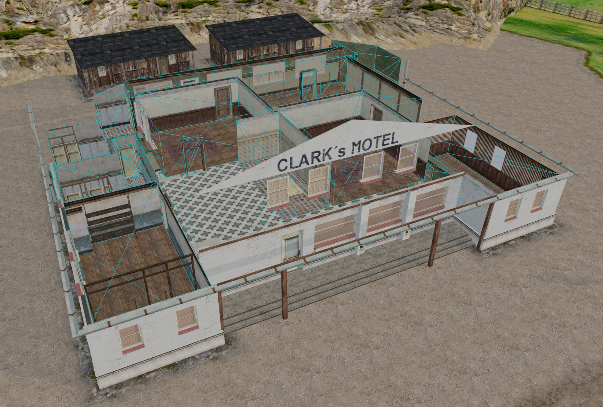

# Mafia Blender Toolkit

A Blender add-on for Mafia's model formats: **`.4ds` models**, **`.5ds` animations**,
**`.tck` movement tracks** and **`.6ds` shadows** — import, edit and export, with every
frame type and every flag the format has.

Built for **Blender 5.2** or newer. Tested against every model the game ships.



## What it does

- **All four formats**, in and out, through **File ▸ Import** and **File ▸ Export**.
- **15 of the 17 frame types** and all 9 visual sub-types: meshes and their LODs, sectors
  and portals, occluders, dummies, targets, lights, billboards, mirrors, lens flares,
  projectors, morphs, joints and skinned characters, cameras and scene frames.
  (Sound and Area frames cannot be supported — the engine stores nothing but a type byte
  and a parent for them.)
- **Round-trips byte for byte.** A model imported and exported again comes back identical,
  the save date aside — which is the strongest thing that can be said about an importer:
  whatever the file held survived the trip, whether or not there is a control for it.
- **Says what is wrong before it writes.** *Check 4DS Scene* runs every export check
  without writing a file, and each refusal carries a suggested fix. A failed export leaves
  whatever was there untouched.
- **Characters**: the skeleton preset, influence boxes with draggable handles, weights
  painted by hand or made from the boxes, and the rules the game's own weights obey.
- **Draws what Blender does not**: dummy boxes, mirror bounds and view boxes, projector
  volumes, what a light reaches, each joint's influence box, and the frame an armature
  stands on.
- **A command line**, the MBT CLI, so another program can hand a model to Blender.

## Installing

Download `mafia-toolkit-1.0.0.zip` from [Releases](../../releases), then in Blender:
**Edit ▸ Preferences ▸ Add-ons ▸ Install from Disk**, pick the zip, and switch it on.

Then set the **Texture Folder** in the add-on's preferences to the game's `maps`
directory — a model names its textures by file name, so without it everything imports
grey.

Or from a command prompt, with nothing but Blender on the machine — unpack the zip
anywhere and run the `mbt.bat` inside it:

```bat
mbt --install --textures "D:\Hry\Mafia Editovani\maps"
```

## The MBT CLI

The same add-on, driven without a window — for converting a folder of files, putting it
in a script, or handing a model to Blender from another program:

```bat
mbt --open "D:\models\tommy.4ds" --check
mbt --open "D:\models\tommy.4ds" --export "D:\out\tommy.4ds"
mbt --open "D:\models\tommy.4ds" --gui
```

It finds Blender itself and needs no Python of its own. Exit codes: `0` done, `1` a step
refused, `2` a command that made no sense, `3` no Blender found. `mbt --help` lists the
rest.

## Documentation

| Page | What it answers |
|---|---|
| [User Guide](LS3D-4DS-User-Guide.html) | The way in, in the order you meet it: installing, a tour, a first model, the checks, a prop with LODs, materials, a car, a character, animation. |
| [Field Manual](LS3D-4DS-Field-Manual.html) | The reference: every frame type, every panel of switches, every check, and what the format holds. |
| [Dummy Names](LS3D-4DS-Dummy-Names.html) | Every frame name the game looks for — vehicles, characters, weapons, the city — with the type each needs and what happens when it is wrong. |
| [User Properties](LS3D-4DS-User-Properties.html) | The text a frame can carry in square brackets, and what reads it. |
| [Flag Usage](LS3D-4DS-Flag-Usage.html) | Which flag bits the game's own models actually use. |
| [Joint Viewer](LS3D-4DS-Joint-Viewer.html) | Opens a `.4ds` in the browser and draws its joints, weights and influence boxes. |

The [wiki](../../wiki) has the same ground in shorter pages.

## Building from source

```bat
build-dev.bat        :: the workshop build, with the test suite, installed into Blender
build-release.bat    :: what ships: the add-on and nothing else
```

The workshop build carries `io_mafia_toolkit/tools/` — the proving suite and the corpus
verifiers — so the Blender it lands in can run the tests against exactly what is
installed. The release build leaves all of that out.

## How it is tested

Every change is run against the whole corpus the game ships:

| What | Files | Result |
|---|---|---|
| Models, through Blender | 3,125 | round-trip identical |
| Models, format layer only | 3,125 | 3,123 exact, 2 refused for their version |
| Animations | 2,695 | all exact — 52,132 tracks, 13.7M keys |
| Movement tracks | 293 | 283 exact, 10 refused for their version |
| Shadows | 37 | all exact |

Plus a suite of regression checks covering sectors, portals, mirrors, billboards,
instances, animations, event cues, movement tracks, shadows, materials and characters.

## License

The add-on's code and this documentation are **GPL-3.0-or-later** — see
[LICENSE](LICENSE). A Blender add-on uses Blender's Python API, which is GPL, so a
GPL-compatible license is what it has to carry.

Four things that licence does *not* cover:

- **The game.** This add-on contains no code, no engine and no data from Mafia. It reads
  and writes file formats; it needs a legally obtained copy of the game to be of any use,
  and the game's own EULA governs what you do with its files.
- **The screenshots.** The pictures in `guide-images/` show the game's own models and
  textures, which remain the property of Illusion Softworks / Take 2 Interactive. They
  are here to illustrate the tool, and are not licensed under the GPL.
- **What you make with it.** Your models are yours; distributing them is subject to the
  game's terms, not to this licence.
- **Game files in this repository.** There are none, and there should never be any: no
  `.4ds`, `.5ds`, `.tck` or `.6ds` from the game belongs in a commit.

Not affiliated with or endorsed by Illusion Softworks, Take 2 Interactive or 2K.
