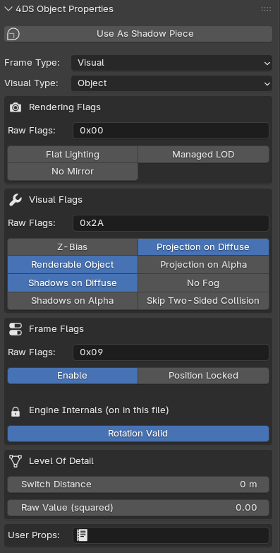
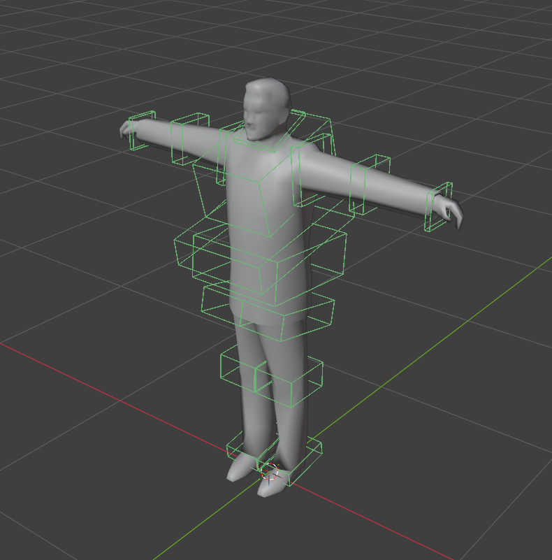

<div align="center">

# Mafia Blender Toolkit

**Everything *Mafia: The City of Lost Heaven* keeps in a model file — models, animations, movement tracks and shadows — in Blender, and back in the game.**

[](https://www.blender.org/)
[](https://github.com/Richard01CZ/MafiaBlenderToolkit/wiki/Importing-and-Exporting)
[](https://github.com/Richard01CZ/MafiaBlenderToolkit/wiki)
[](LICENSE)

[Features](#-features) · [Quick Start](#-quick-start) · [Documentation](#-documentation) · [Command Line](#-the-mbt-cli) · [Limitations](#️-known-limitations) · [Credits](#-credits)


*Clark's Motel, imported straight from the game — the cyan wireframes are its interior [sectors](https://github.com/Richard01CZ/MafiaBlenderToolkit/wiki/Sectors-and-Portals).*

</div>

---

## ✨ Features



- **All four formats**, in and out — `.4ds` models, `.5ds` animations, `.tck` movement tracks, `.6ds` shadows
- **15 of the 17 frame types** and all nine visual sub-types — everything the format has but Sound and Area, which hold nothing to import
- **Round-trips byte for byte** — a model imported and exported again comes back identical, the save date aside
- **Complete material system** — diffuse, alpha and environment textures, color keys read from the texture's own palette, animated textures, with a viewport preview that draws what the game draws
- **Skinned characters** — the skeleton preset, influence boxes with draggable handles, weights painted by hand or made from the boxes
- **Morph animations** — groups and targets in a panel of their own, regions worked out for you
- **Level geometry** — sectors, portals and occluders, checked for the closed volumes the engine needs
- **Special visuals** — billboards, mirrors with their view boxes, lens flares, projectors, lights, dummies and look-at targets
- **LODs** — the whole chain in one frame, by a naming rule and nothing else
- **A color-coded viewport** — every frame type its own color, and the boxes and volumes Blender itself would never draw
- **Checks that say what to do** — nothing exports silently broken; each refusal carries a suggested fix
- **A command line** — hand a model to Blender from a script or another program

<br clear="all">

<div align="center">



*A character's influence boxes, with the handles on the joint being posed — six to resize, three to slide, three to turn.*

</div>

## 🚀 Quick Start

1. **Download** — grab `mafia-toolkit-1.0.0.zip` from [Releases](https://github.com/Richard01CZ/MafiaBlenderToolkit/releases/latest).
2. **Install** — in Blender, `Edit ▸ Preferences ▸ Add-ons ▸ Install from Disk…`, pick the zip, and switch **Mafia Toolkit** on.
3. **Set the texture folder** — in the add-on preferences, point **Texture Folder** at your Mafia `maps` folder, or imports come in grey.
4. **Import** — `File ▸ Import ▸ 4DS Mafia Model` — and you're in.

Exporting your own model? Read [Checks and Messages](https://github.com/Richard01CZ/MafiaBlenderToolkit/wiki/Checks-and-Messages) first — it lists every rule the engine enforces and what to do about each.

## 📚 Documentation

The **[project wiki](https://github.com/Richard01CZ/MafiaBlenderToolkit/wiki)** covers it page by page:

| I want to… | Read this |
|---|---|
| Install and configure the add-on | [Installation and Setup](https://github.com/Richard01CZ/MafiaBlenderToolkit/wiki/Installation-and-Setup) |
| Import / export models | [Importing and Exporting](https://github.com/Richard01CZ/MafiaBlenderToolkit/wiki/Importing-and-Exporting) |
| Understand frame & visual types | [Frame Types](https://github.com/Richard01CZ/MafiaBlenderToolkit/wiki/Frame-Types) |
| Set up game materials & textures | [Materials](https://github.com/Richard01CZ/MafiaBlenderToolkit/wiki/Materials) |
| Create LODs | [Objects and LODs](https://github.com/Richard01CZ/MafiaBlenderToolkit/wiki/Objects-and-LODs) |
| Rig a character | [Armatures and Skinning](https://github.com/Richard01CZ/MafiaBlenderToolkit/wiki/Armatures-and-Skinning) |
| Animate one | [Animations and Movement](https://github.com/Richard01CZ/MafiaBlenderToolkit/wiki/Animations-and-Movement) |
| Build interiors | [Sectors and Portals](https://github.com/Richard01CZ/MafiaBlenderToolkit/wiki/Sectors-and-Portals) |
| Fix an export error | [Checks and Messages](https://github.com/Richard01CZ/MafiaBlenderToolkit/wiki/Checks-and-Messages) · [Troubleshooting](https://github.com/Richard01CZ/MafiaBlenderToolkit/wiki/Troubleshooting) |

And in this repository, the long form:

| Document | What is in it |
|---|---|
| [User Guide](LS3D-4DS-User-Guide.html) | The way in, in the order you meet it — installing, a tour, a first model, a prop, a car, a character |
| [Field Manual](LS3D-4DS-Field-Manual.html) | The reference: every frame type, every panel of switches, every check |
| [Dummy Names](LS3D-4DS-Dummy-Names.html) | Every frame name the game looks for, the type each needs, and what happens when it is wrong |
| [User Properties](LS3D-4DS-User-Properties.html) | The text a frame can carry in square brackets, and what reads it |
| [Flag Usage](LS3D-4DS-Flag-Usage.html) | Which flag bits the game's own models really set |
| [Joint Viewer](LS3D-4DS-Joint-Viewer.html) | Opens a `.4ds` in the browser and draws its joints, weights and influence boxes |

## 🖥 The MBT CLI

The same add-on without a window — for converting a folder of files, putting it in a
script, or handing a model to Blender from another program. It finds Blender itself and
needs no Python of its own:

```bat
mbt --install --textures "D:\Hry\Mafia Editovani\maps"
mbt --open "D:\models\tommy.4ds" --check
mbt --open "D:\models\tommy.4ds" --export "D:\out\tommy.4ds"
mbt --open "D:\models\tommy.4ds" --gui
```

Exit codes: `0` done · `1` a step refused · `2` a command that made no sense · `3` no
Blender found. See [Command Line](https://github.com/Richard01CZ/MafiaBlenderToolkit/wiki/Command-Line).

## ✅ Tested against everything the game ships

| What | Files | Result |
|---|---|---|
| Models, through Blender | 3,125 | round-trip identical |
| Models, format layer only | 3,125 | 3,123 exact, 2 refused for their version |
| Animations | 2,695 | all exact — 52,132 tracks, 13.7M keys |
| Movement tracks | 293 | 283 exact, 10 refused for their version |
| Shadows | 37 | all exact — 110 pieces, 3,935 triangles |

Plus a suite of regression checks over sectors, portals, mirrors, billboards, instances,
animations, event cues, movement tracks, shadows, materials and characters, run on every
change.

## ⚠️ Known Limitations

- Only **4DS version 29** (Mafia for PC) is read — HD2 (v41) and Chameleon (v42) are not.
- **Sound** and **Area** frames are skipped on import: the engine keeps nothing but a type
  byte and a parent for them, so there is nothing to bring in or write back.
- One **armature** and one **skinned mesh** per character, and at most **64 joints** below
  it — both engine limits, enforced at export.
- A **projector** and a **lens flare** need a material before they can be written: the
  format keeps a material number, and zero is not one.

## 🛠 Building from source

```bat
build-dev.bat        :: the workshop build, with the proving suite, installed into Blender
build-release.bat    :: what ships: the add-on and nothing else
```

The workshop build carries `io_mafia_toolkit/tools/` — the proving suite and the corpus
verifiers — so the Blender it lands in can run the tests against exactly what is
installed.

## 🧡 About the Project

- Grew out of the single-file **Mafia4Blender 4DS** add-on (0.6.2), rewritten as a package
  and widened from one format to four.
- Developed with the help of AI.
- Built by reading what the game actually does and checking it against every model it
  ships, rather than inheriting assumptions from older tools.

Found a bug or a missing feature?
**[Open an issue](https://github.com/Richard01CZ/MafiaBlenderToolkit/issues)** — reports
with a `.blend` or a `.4ds` sample are the fastest to fix.

## 🙏 Credits

**Richard01_CZ**

Special thanks to *Asa, Oravin, kirill_mapper, FlashX, sadness_smile, huckleberrypie* and
*jc* for research, testing and flag documentation.

## 📄 License

The add-on's code and this documentation are **GPL-3.0-or-later** — see [LICENSE](LICENSE).
A Blender add-on uses Blender's Python API, which is GPL, so a GPL-compatible license is
what it has to carry.

Four things that licence does *not* cover:

- **The game.** This add-on contains no code, no engine and no data from Mafia. It reads
  and writes file formats; it needs a legally obtained copy of the game to be of any use,
  and the game's own EULA governs what you do with its files.
- **The screenshots.** The pictures in `guide-images/` show the game's own models and
  textures, which remain the property of Illusion Softworks / Take 2 Interactive. They are
  here to illustrate the tool, and are not licensed under the GPL.
- **What you make with it.** Your models are yours; distributing them is subject to the
  game's terms, not to this licence.
- **Game files in this repository.** There are none, and there should never be any: no
  `.4ds`, `.5ds`, `.tck` or `.6ds` from the game belongs in a commit.

Not affiliated with or endorsed by Illusion Softworks, Take 2 Interactive or 2K.
